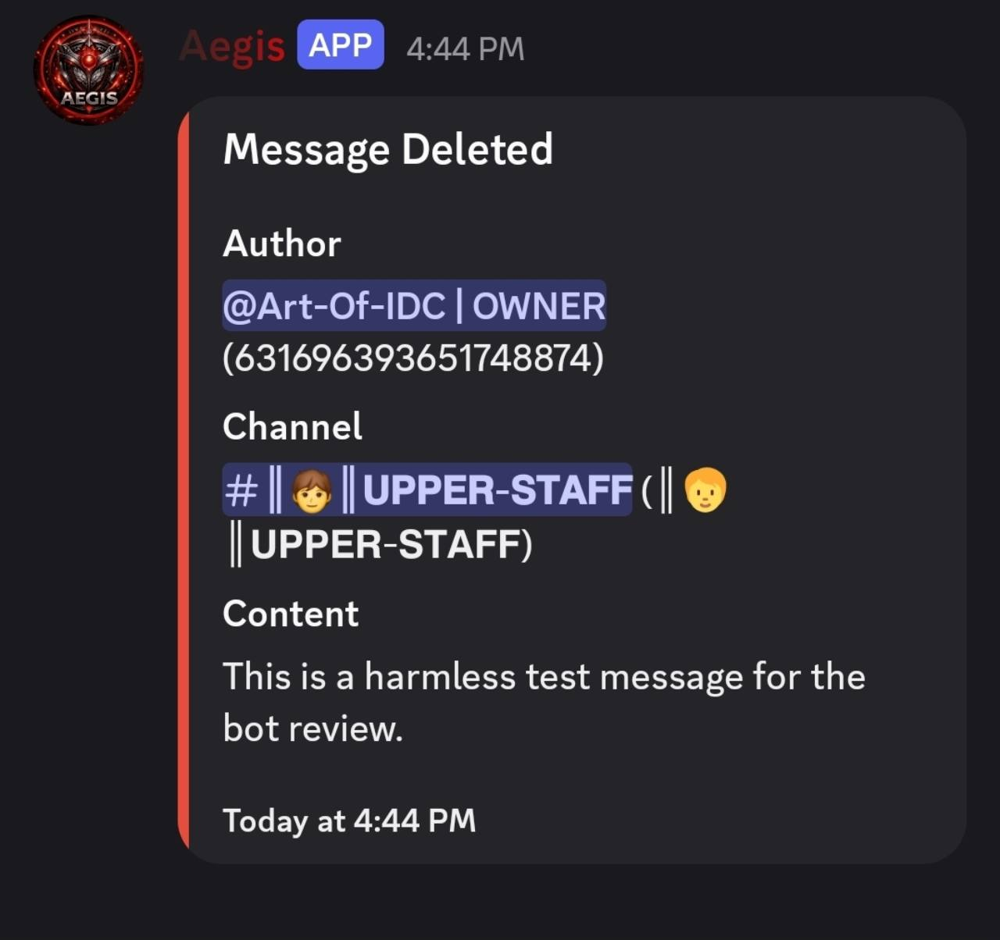

# Aegis — Message Content evidence

## Deleted-message audit

This original screenshot shows Aegis's **Message Deleted** audit embed with readable message text, author information, the source Discord channel and a timestamp.

The harmless review message shown is:

> This is a harmless test message for the bot review.

The output demonstrates Aegis retaining readable content for its deleted-message audit. This page includes the audit-output screenshot; a separate screenshot of the original message before deletion is not included.

[Open original screenshot](https://raw.githubusercontent.com/iArtemisia/starz-discord-review/main/aegis-message-deleted.jpg)

The image is published unchanged as supplied for the application's Message Content evidence.
