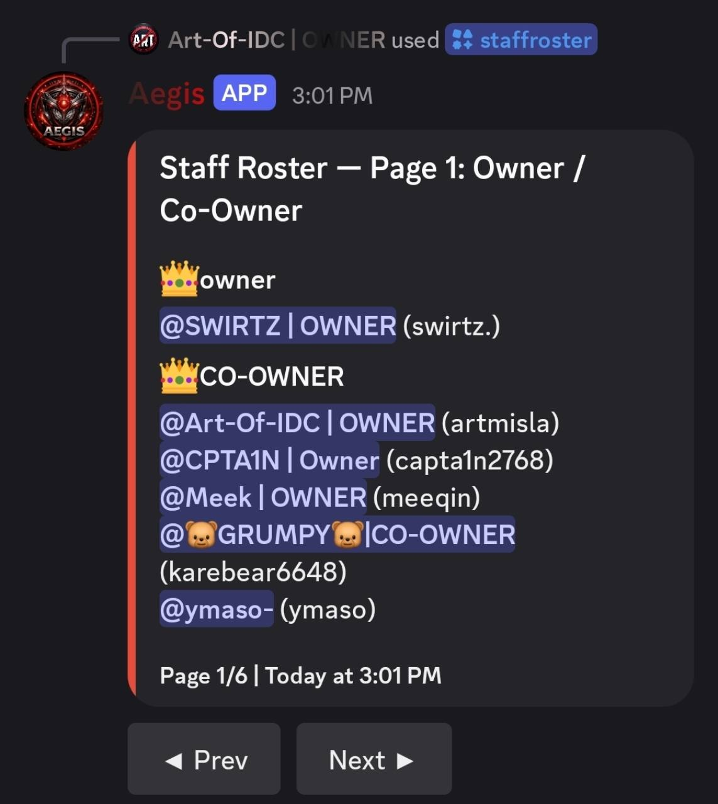
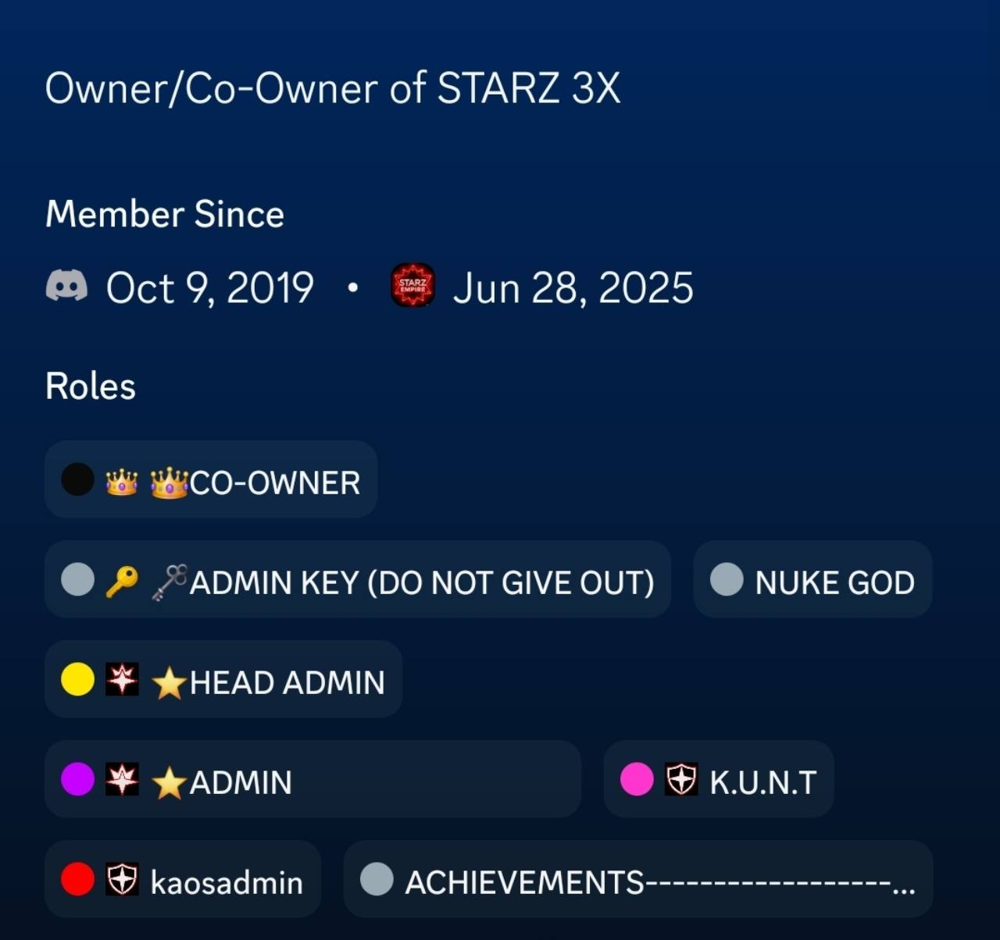

# Aegis — Server Members evidence

These original screenshots show Aegis's role-based staff roster and supporting Discord staff-role context for a Server Members (Guild Members) intent review.

## Aegis staff roster

The screenshot shows the `/staffroster` invocation and Aegis's **Staff Roster — Page 1: Owner / Co-Owner** response. The roster groups current server members by staff role and displays their Discord mentions and account names. This illustrates Aegis's use of member identities and role membership for staff administration.

[Open original roster JPG](https://raw.githubusercontent.com/iArtemisia/starz-discord-review/main/aegis-staff-roster.jpg)

## Supporting staff-role context

This cropped Discord profile shows server membership information and role badges, including **CO-OWNER**. The username/profile header is not visible in this crop, so the image provides role context but does **not independently establish which roster member it belongs to**.

[Open original role-profile JPG](https://raw.githubusercontent.com/iArtemisia/starz-discord-review/main/aegis-staff-role-profile.jpg)

The JPGs are published unchanged as supplied. This page is evidence for the member/role roster use case, not proof of Message Content or Presence access, a privacy policy, or a claim that Discord has approved the application.
