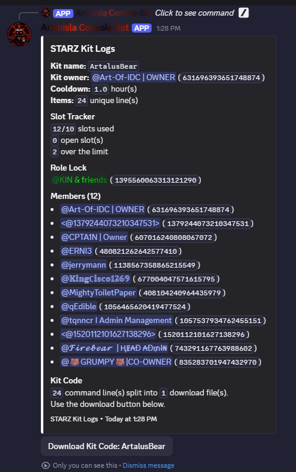
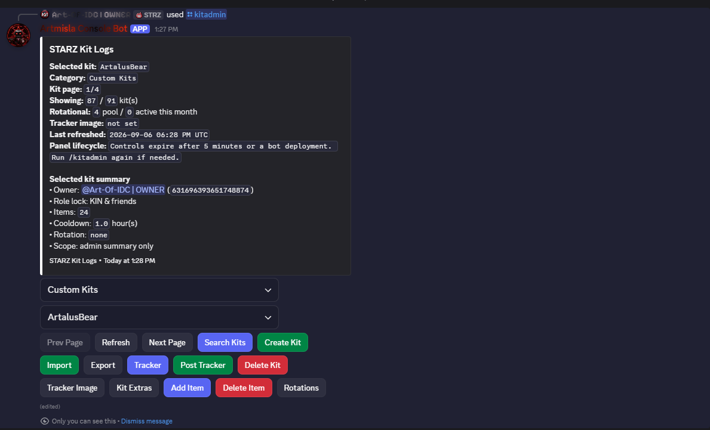
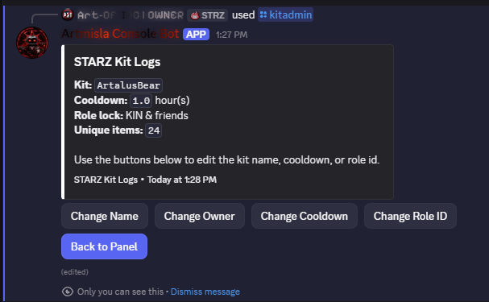

# STARZ Kit Bot — Discord Review Evidence

[← Back to documentation](README.md) · [Privacy Policy](kit-bot-privacy-policy.md)

## Members Intent: role-holder tracker

The Kit Tracker screenshot shows the selected ArtalusBear kit and its KIN & friends role lock. The bot lists Members (12) and reports 12/10 slots used, zero open slots, and two over the limit. This demonstrates the ongoing role-holder enumeration and counting use case for Guild Members access. A lookup of only the person invoking a command cannot supply the complete role-holder list.

The screenshots show the bot under its Discord display name Artmisla Console Bot, with STARZ Kit Logs embeds.

## Kit administration context

The private /kitadmin panel shows the same selected kit and role lock, alongside the Tracker control used to view the member list. This screenshot provides the surrounding workflow; the tracker above is the direct member-information evidence.

## Role-lock configuration context

The Kit Extras panel shows the same kit and KIN & friends role lock, along with the role-ID configuration control. It illustrates how a kit is associated with a Discord role.

