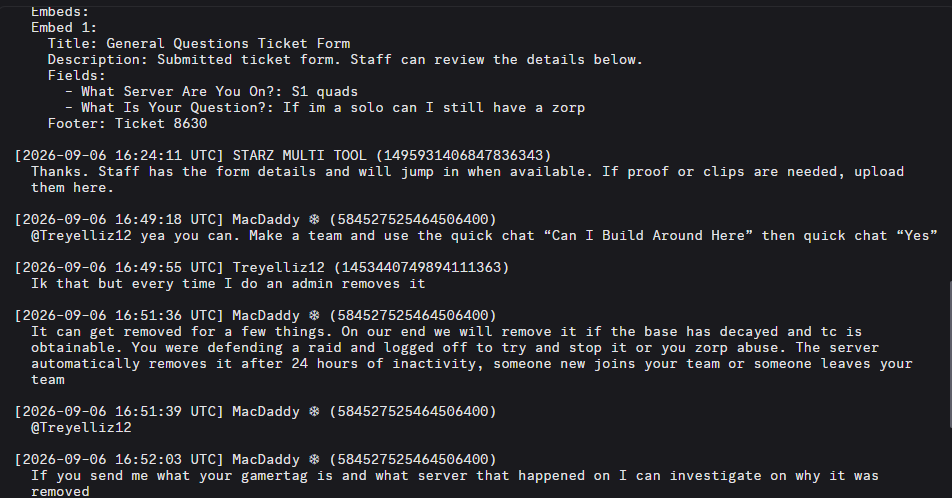
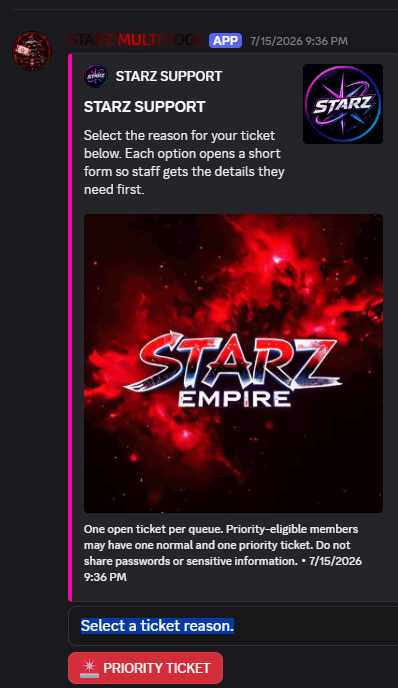
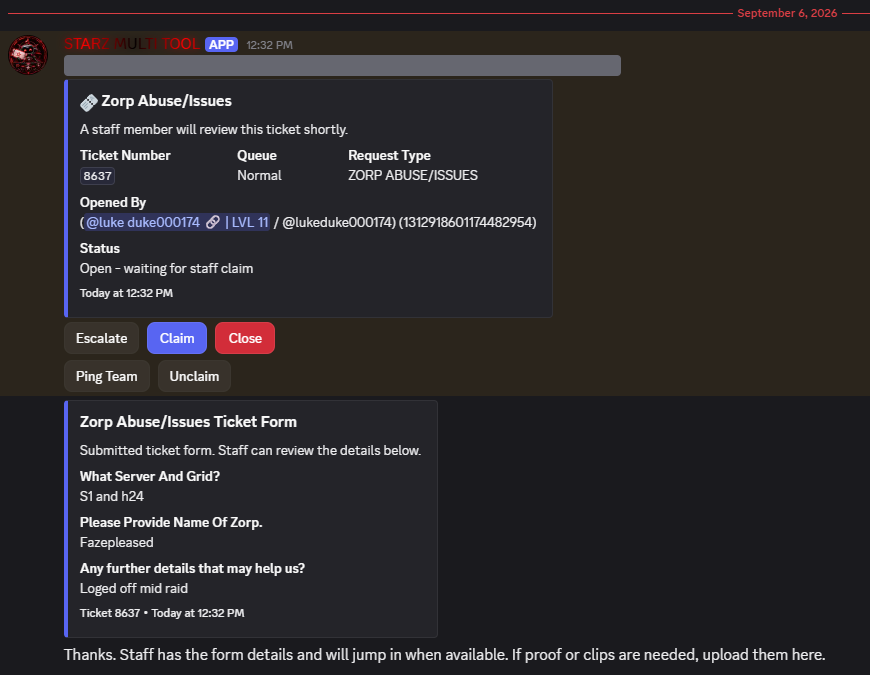
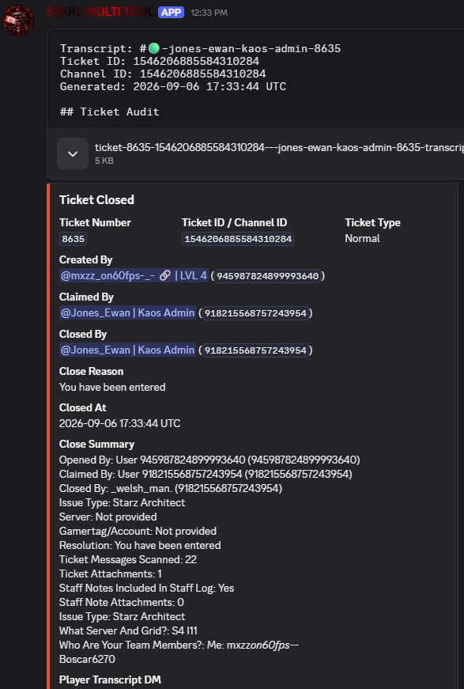

# STARZ Ticket Bot — Discord Review Evidence

[← Back to documentation](README.md) · [Privacy Policy](ticket-bot-privacy-policy.md)

## Message Content Intent: saved ticket conversation

The opened transcript below preserves ordinary user and staff messages with authors and timestamps, including messages that do not mention the bot. This demonstrates the transcript feature's use of message content: slash commands or intake forms alone cannot supply the existing ticket conversation. The transcript identifies the bot as STARZ MULTI TOOL with application ID 1495931406847836343, the STARZ Ticket Bot application under review.

## Ticket workflow examples

The following screenshots show separate examples of the ticket workflow; they are not one continuous ticket conversation.

### Ticket creation panel

The support panel lets a member choose a ticket reason and offers priority ticket entry.

### Created ticket and intake details

The bot posts the ticket's queue, status, submitted intake details, and staff controls after ticket creation. This provides workflow context for the transcript feature.

### Closure summary and transcript attachment

The closure example shows a generated transcript attachment, the ticket's closing information, and the number of messages scanned. The opened transcript above provides the direct evidence of preserved conversation text.

